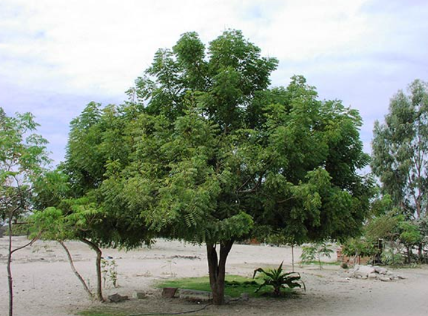
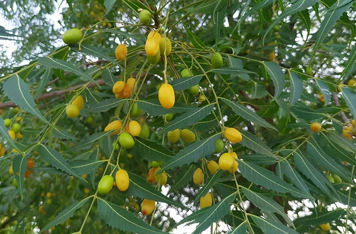

<html lang="en">
<head>
    <meta charset="UTF-8">
    <meta name="viewport" content="width=device-width, initial-scale=1.0">
    <title>🌿 Neem Tree (వేప చెట్టు)</title>
    
</head>
<body>
    
    
    <h1>🌿 Neem Tree (వేప చెట్టు) 🌿</h1>
     
    

        
        
    

    
    
The <em>Neem Tree</em> (Azadirachta indica) is a revered evergreen native to the Indian subcontinent. Known as "Nature's Pharmacy," every part of this tree - from roots to leaves - has medicinal value in Ayurveda.

    
    <h2>📊 Classification:</h2>
    
Belonging to the mahogany family (Meliaceae), this drought-resistant tree grows up to 30m tall. Its dense canopy provides excellent shade, making it ideal for tropical climates.

    
    <h2>🎉 Ugadi Significance:</h2>
    <ul>
        <li><strong>Ugadi Pachadi:</strong> Neem flowers add the essential bitter taste representing life's challenges </li>
        <li><strong>Doorway Decor:</strong> Fresh neem leaves tied at entrances purify the home during Ugadi </li>
        <li><strong>New Beginnings:</strong> Symbolizes renewal and detoxification for the new year </li>
        <li><strong>Traditional Bath:</strong> Neem-infused water used for Ugadi purification baths </li>
    </ul>
    
    <h2>💊 Medicinal Marvels:</h2>
    <ul>
        <li><strong>Skin Savior:</strong> Treats acne, eczema and fungal infections </li>
        <li><strong>Blood Purifier:</strong> Detoxifies blood and boosts immunity </li>
        <li><strong>Oral Health:</strong> Neem twigs used as natural toothbrushes </li>
        <li><strong>Pest Control:</strong> Natural pesticide for organic farming </li>
    </ul>
    
    <h2>In Indian Heritage:</h2>
    <ul>
        <li><strong>Sacred Tree:</strong> Mentioned in ancient Ayurvedic texts as Sarva Roga Nivarini ("curer of all ailments") </li>
        <li><strong>Village Pharmacy:</strong> Found in nearly every Indian village for community use </li>
        <li><strong>Climate Warrior:</strong> Excellent at carbon sequestration and soil improvement </li>
    </ul>
    
    <footer>Bhoj Reddy Engineering College for Women - CSE Department</footer>
</body>
</html>
